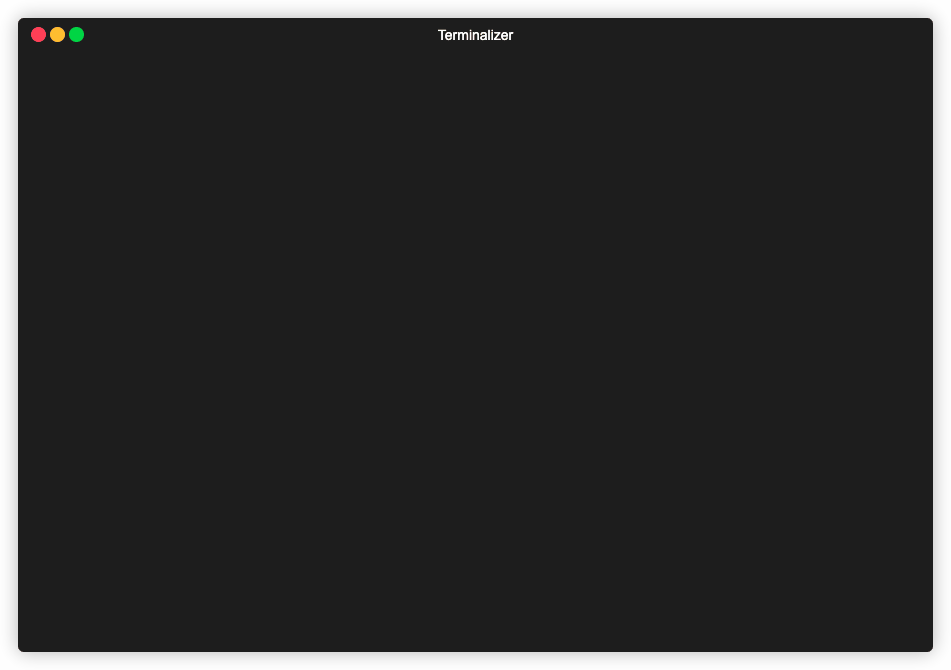

# Card Game

## Rools 

A simple CLI game where you're playing with some very intelegent AI (i guess it's smarter than me).

Rools are simple:

- Two options - beat AI card or surrender and computers will kill all humans
- To beat a card you need to match a suit or you need to match a rank
- Everyone gets the same amount of cards at the begining
- If you'll get rid of your cards faster than AI does - you won (good luck with that, pal)
- Thats all
- Have fun
- Glory to machines!

## Usage

