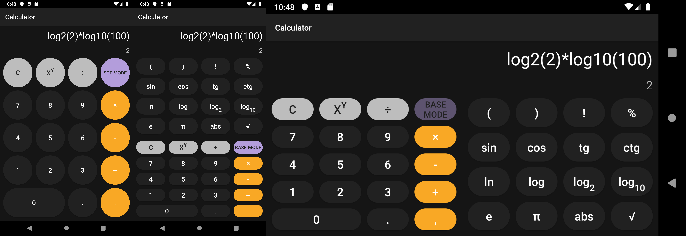

# Calculator

## Features

* Two versions of app using power of product flavours: demo and full

* Basic numeric mode and scientific mode 

* Implicit multiplication 

* Functions like sin, cos etc. deleting properly

* BaseFragment and ScientificFragment passing data to MainActivity through interface (more abstractions - better app)

## Screenshots

