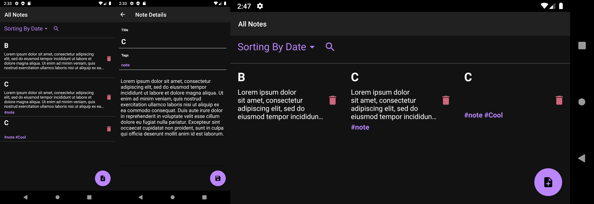
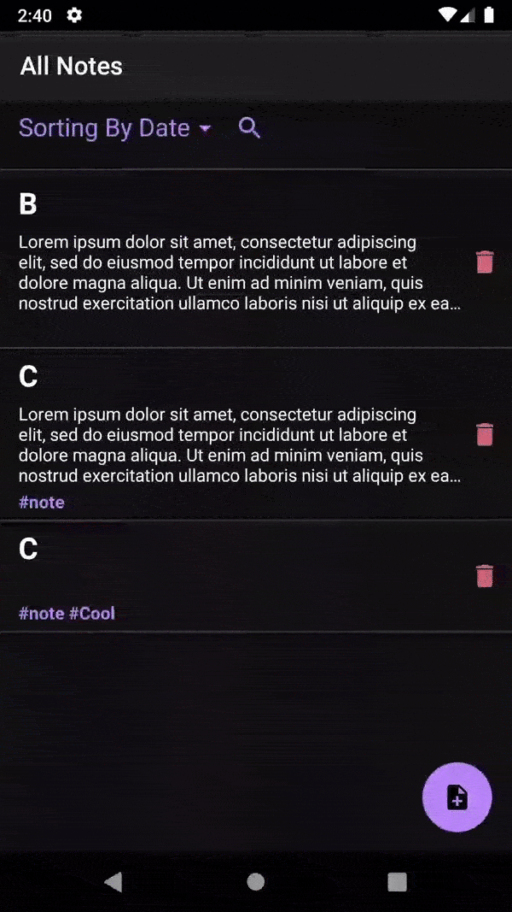

# Notes

## Features

* App is using `Material components` for better UI look (what? good looking UI in Android, impossible...)

* `Navigation components` is used to perform navigation and finally there's no need to think about how you work with fragments 

* Tags

* Searching by tag

* Sorting by date and title

* Support of landscape orientation 

* In landscape orientation notes shows as grid not list (like Google Keep)

* If title is empty current date is used instead 

* App is using `Room` as DB solution

## Screenshots

## Usage

